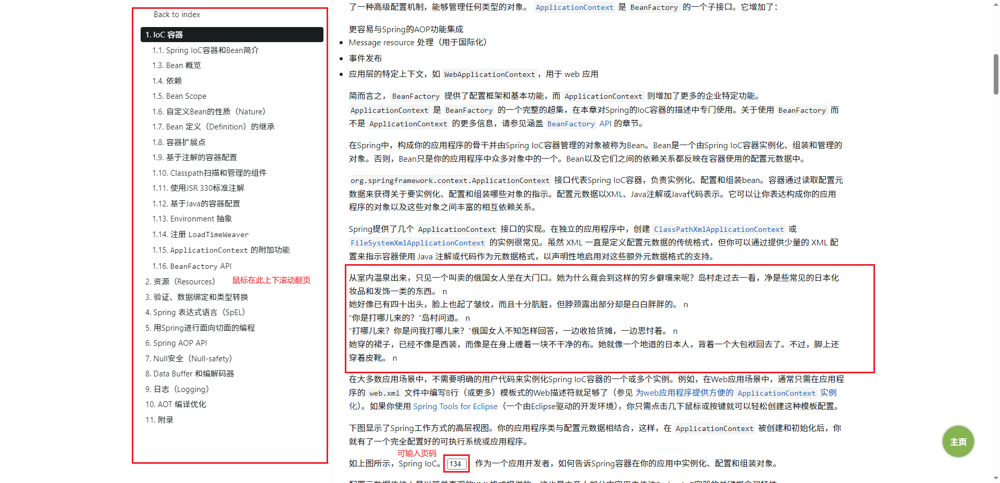
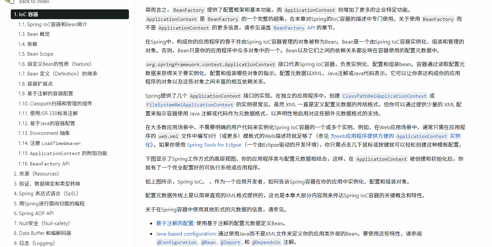

# Reader
摸鱼读书帮手



下载reader.zip，解压里面有程序本体和配置文件，点击进入配置文件修改书籍路径，保存txt，双击程序启动。

配置文件需要和程序在同一个文件夹中。 地址默认为127.0.0.1:8996。

页面会保存你的阅读页数，下次进入可以继续阅读，进入页面默认不显示内容，右键一下页面任意位置显示，在左侧目录上下滚动翻页。

你可以随时进行右键隐藏内容，再次右键显示。

配置文件内容如下：

```text
#唯一必填项，其他参数可省略
#书籍的全路径，最好不要带中文
path=D:\project\demo1\xg.txt

#每页大小
size=5

#项目启动端口
port=8996

#1开启，0关闭
#标记换行 n，如果设置为True，会在根据这一行和下一行中间隔了多少空行添加对应次数的‘n’，提示用，作用不大
mark=0

#1开启，0关闭
#启动后是否隐藏，如果设置隐藏，则需要去任务管理器去关闭
hide=0
```
